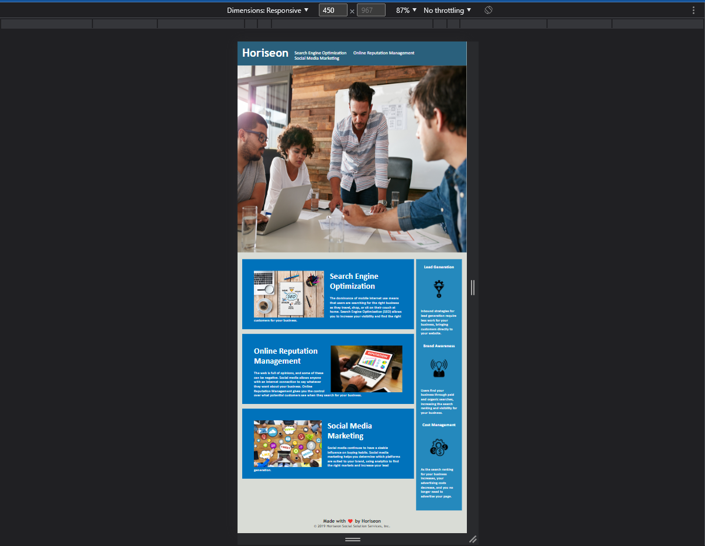

In this challenge I was able to practice what I've learned this week about css. 

I've adjusted both the css and html file to make it more accessible at resolutions smaller than 768px. 

Screenshot of the page at resolution a smaller resolution:
 

Link to deployed application: 
https://mlmcdan1.github.io/challenge-1/
